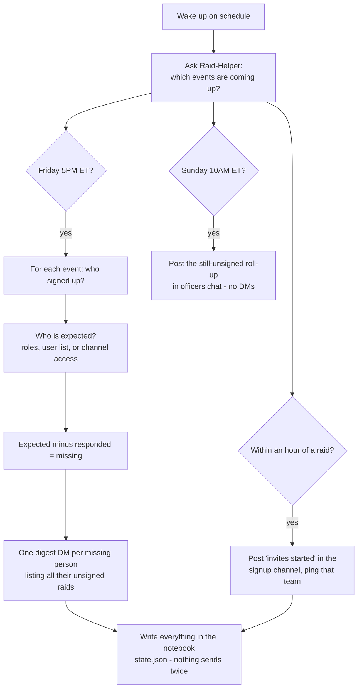

# The Complete Guide: Automated Raid Signups, Reminders, and Announcements

This guide explains the whole system from zero — what Raid-Helper Premium
already covers by itself, what this project adds, how to set it all up once,
and how to maintain it. It is written so that the person running it does not
need to be a programmer.

The target workflow it delivers, end to end:

1. Signups for every raid night appear automatically each week *(Raid-Helper Premium — section 2.1)*
2. Friday 5PM ET: everyone expected who hasn't signed up gets one DM listing their unsigned raids *(this project)*
3. Members get a gear/consumes DM the moment they sign up *(Raid-Helper Premium — section 2.2)*
4. About an hour before each raid (configurable): "invites started, whisper Kcin" posted in the signup channel, pinging @raiders *(this project)*
5. Attendance is tracked automatically *(Raid-Helper — section 2.3)*

---

## 1. The original requirements, and how each one is addressed

This system exists to satisfy five requirements, stated originally as:

> 1. Creates a Signup for each Raid Night (Tuesday, Wednesday, Thursday, and
>    Sunday) at Tuesday 7PM EST
> 2. Reminds people via a discord message that have access to the channel to
>    signup for each raid on Friday at 5PM EST
> 3. Will send out a discord message to them when they Signup to make sure
>    they have their Gear and Consumes required in the consume FAQ channel
> 4. On Tuesday, Wednesday, Thursday, and Sunday at 8:15 PM EST a discord
>    message in the signup channel that @raiders and says: "Raid invites has
>    started for tonight's raid. Please have your gear and consumes. Whisper
>    Kcin or an Officer for an invite!"
> 5. Tracks Raid Attendance

How each is met, and by which part of the stack:

**Requirement 1 — recurring signups.** Native Raid-Helper **Premium**
("Recurring Events"). Each raid night is set up once as a weekly recurring
event; Raid-Helper posts the new week's signups automatically from then on.
Setup: section 2.1. Nothing in this project is involved.

**Requirement 2 — Friday 5PM reminder to those who haven't signed up.**
**This project** (Raid-Helper itself only has the *manual* `/unsigned`
command — no scheduled version exists). The script runs every Friday at 5PM
Eastern via the GitHub Actions schedule, compares each upcoming raid's
sign-up list against that raid's expected members, and DMs everyone missing
— one digest DM listing all their unsigned raids. "People that have access
to the channel" is expressed as an *audience*: normally the team's role
(which is what grants channel access), or — if channel access doesn't map to
a role — the `channel_access` audience type, which computes viewers directly
from the channel's permission settings. How it works: section 3; audiences:
section 4.

**Requirement 3 — gear/consumes DM on signup.** Native Raid-Helper
**Premium** (the `response` advanced setting: "Sends members the specified
text or embed via DM after successful Sign-Up"). Set once on the recurring
events, pointing members at the consume FAQ channel. Setup: section 2.2.

**Requirement 4 — the 8:15PM "invites started" post.** **This project**
(Raid-Helper's built-in `reminder` setting pings *people who signed up*, not
a role, and its text isn't customizable to this wording). The script's
`announcements` config posts the exact requested message into each event's
own signup channel, mentioning @raiders, starting **60 minutes before raid
start** (`minutes_before`, freely changeable) — on every raid night,
automatically. The schedule checks every 15 minutes during evening hours,
so the post lands 45–60 minutes before start. Config: section 7.

**Requirement 5 — attendance tracking.** Native Raid-Helper (the
`attendance` advanced setting, on by default) with stats via `/attendance`;
supports per-team tags. Setup: section 2.3. Nothing in this project is
involved.

In short: **1, 3, and 5 are configuration inside Raid-Helper Premium** (no
code, no hosting — verify them via section 2), and **2 and 4 are this
project** — a single scheduled script that fills the two gaps Raid-Helper
doesn't cover:

| Need | Covered by |
|---|---|
| Recurring weekly signups | Raid-Helper **Premium** (native) |
| DM after signing up ("bring consumes") | Raid-Helper **Premium** (native) |
| Attendance tracking | Raid-Helper (native) |
| Reminding people who **haven't** signed up | **This project** (Raid-Helper only has the manual `/unsigned` command) |
| Scheduled "invites started" channel posts with custom text + @role ping | **This project** (Raid-Helper's built-in reminder pings *attendees only*, not a role) |

---

## 2. The Raid-Helper Premium features (no code, just configuration)

These are settings inside the bot you already pay for. They may already be
configured on your server — this section is the checklist to verify.

### 2.1 Recurring events (weekly signups create themselves)

Premium feature "Recurring Events" — *"let the bot create your regular events
automatically."* Set each raid night up once as a weekly recurring event:

- Create each raid night's event via `/create` (typed in the signup
  channel's message box in Discord) — or, easier for this, the Raid-Helper
  web dashboard: **raid-helper.dev** -> Login (top right, with your Discord
  account) -> your server. Enable **recurring / weekly repeat** in the event
  options.
- Each recurring series controls when the next occurrence gets posted, so the
  new week's signups appear on schedule without anyone touching anything.
- Four raid nights (e.g. Team A Tue/Thu, Team B Wed/Sun) = four recurring
  series, each posting into its team's signup channel.

### 2.2 Sign-up confirmation DM (gear and consumes)

The `response` **advanced setting** (premium): *"Sends members the specified
text or embed via DM after successful Sign-Up."* In the event's advanced
options (on the web dashboard: open the event -> advanced settings; or in
Discord during `/create` / via `/edit`), set for example:

```
< response: Thanks for signing up! Make sure you have your gear enchanted and full consumes - see the #consume-faq channel. >
```

You can also point it at a saved embed id (`/embed` creates one) for a richer
message. Add it to the recurring events once and every future occurrence
inherits it.

### 2.3 Attendance tracking

The `attendance` advanced setting (on by default) counts events toward your
server's statistics; query them any time with `/attendance`. Tip: give each
team's events a tag (`< attendance: teamA >`) so you can pull per-team stats.

### 2.4 The manual stopgap: `/unsigned`

Even with the automation running, this command is handy for spot checks:

```
/unsigned list id:<eventID>
/unsigned message id:<eventID> option:direct message text:Don't forget to sign up!
```

It targets members who hold the roles set via `/set raider_roles` (any roles)
and haven't responded. This is the manual version of what this project
automates.

---

## 3. How this project's automation works (plain language)

The script runs briefly on a schedule, then exits. It never sits online.



Key ideas:

- **Three jobs, one script, three schedules.** Each has its own workflow file,
  and each file runs exactly one mode — modes are never chosen by looking at
  which schedule fired, because GitHub reports that wrongly after any workflow
  edit.

  | Job | Workflow file | When | Mode |
  |---|---|---|---|
  | Reminder DMs to non-signers | `remind.yml` | Friday 5PM ET | `reminders` |
  | Officer list of who's still unsigned | `officer-unsigned-list.yml` | Sunday 10AM ET | `unsigned-list` |
  | "Invites started" channel post | `announce.yml` | 60 min before each raid | `announcements` |

  The two Friday/Sunday jobs are each declared at **both** possible UTC hours,
  because GitHub's clock can't follow daylight saving. The script checks the
  real Eastern hour and the wrong run quietly does nothing.

- **Friday nudges people; Sunday informs officers.** The Friday run DMs each
  individual non-signer. The Sunday run sends *no DMs at all* — it posts one
  roll-up per raid to officers chat so officers can chase the stragglers for
  the coming week. Sunday also writes nothing to the notebook, deliberately: if
  it recorded people as "reminded", it would cancel the following Friday's DMs
  for everyone it had just listed.
- **Audiences** — who counts as "expected" — are defined per team. Two teams
  raiding twice a week = two audiences + rules mapping each event to its team
  (by signup channel or title). Each of the 4 weekly raids gets exactly the
  right team's non-signers reminded.
- **Digest DMs** — a member missing from several raids gets ONE message
  listing all of them, not a pile of separate pings.
- **The notebook** (`state.json`) records every reminder and announcement, so
  the script can run as often as it likes without double-sending.
- **"Responded" is generous** — anyone who clicked *anything* (Bench, Late,
  Tentative, Absence) is left alone. Configurable.
- **Nobody is nagged after sign-ups close** or after the event starts.

---

### 3.1 Who gets what, on this server (live mapping)

Every message the bot sends is aimed by **one** thing: the channel the event
was posted in. That single rule decides who gets reminded, who gets pinged, and
who shows up in the officer list — there is no second mapping to keep in sync.

| Raid night | Signup channel | Audience | Friday DM goes to | T-60 ping |
|---|---|---|---|---|
| Tuesday | `1412563215396634624` | `teamRed` | Raid Team Red non-signers | @Raid Team Red |
| Wednesday | `1458633730624065673` | `teamBlue` | Raid Team Blue non-signers | @Raid Team Blue |
| Thursday | `1412580181285277770` | `teamRed` | Raid Team Red non-signers | @Raid Team Red |
| Sunday | `1466281351232618621` | `teamBlue` | Raid Team Blue non-signers | @Raid Team Blue |
| *(test channel)* | `1527491633233526824` | `testers` | Kcin + Mike only | Kcin + Mike |

So the Friday reminder is **per team**, never a blanket ping of everyone. A
person who raids on both teams gets **one** combined DM listing every raid they
haven't signed up for, not one per team.

> ⚠️ **The one thing that can go wrong.** If an event is posted in a channel
> that isn't in the table above, no rule matches and it falls through to the
> `default` audience — which is @raiders, 40+ people. Nothing warns you. If a
> raid ever gets set up in a new or renamed channel, add its rule to
> `audience_rules` **before** the first Friday run.

The test channel row is permanent and deliberate: events posted there only ever
reach Kcin and Mike, so the whole pipeline can be exercised for real without
touching the guild. See section 8 for how to run that test.

---

## 4. Audiences: roles, user lists, or channel access

Three ways to define who is expected, mixable per audience:

1. **`role_ids`** (recommended) — members holding any of the listed roles.
   Cleanest when each team has a role (`@TeamA`, `@TeamB`) and the signup
   channels are gated by those same roles.
2. **`user_ids`** — an explicit list of member ids. Blunt but dependable
   escape hatch for odd cases (one-off subs, a member without the role).
3. **`channel_access`** — **the workaround when channels don't line up with
   roles.** Give it a channel id and the script computes, from the channel's
   permission settings, exactly who can *see* that channel — and uses that as
   the expected list. "Everyone who can see Team A's signup channel is
   expected at Team A's raids", no matter how that access is granted (roles,
   individual overrides, anything).

   Caveats of `channel_access`:
   - Server **administrators can see every channel**, so they are counted as
     expected everywhere. If officers shouldn't be nagged, prefer roles, or
     exclude them by keeping a role-based audience.
   - The **bot itself needs access** to the channel to read its permission
     settings — invite it into private team channels.
   - Anyone granted ad-hoc access (e.g. a friend given view rights to spectate)
     becomes "expected." That's the flip side of the convenience.

   Cleanest long-term setup is still: one role per team, channel access granted
   *through* that role. Then `role_ids` and `channel_access` agree perfectly.

---

## 5. One-time setup checklist

Four ingredients, about 15 minutes total.

### 5.1 A Discord bot (sends the DMs and channel posts)

*Field-tested July 17, 2026 — the warnings below are gotchas actually hit
during the first real setup, kept here so the next person sails past them.*

1. Go to https://discord.com/developers/applications (the "Discord Developer
   Portal" — log in with your normal Discord account) → **New Application**
   (button, top right) → name it e.g. `Raid Reminder` → **Create**.
2. Left sidebar → **Bot**:
   - **Reset Token**. Discord will first demand **Multi-Factor
     Authentication** (security key, 6-digit authenticator code, or a backup
     code) — that's normal, complete it. The token is then shown **once**;
     copy it immediately. This is `DISCORD_BOT_TOKEN`. Treat it like a
     password. (Navigated away before copying? Just Reset Token again — the
     newest token is the only one that works.)
   - Scroll down to *Privileged Gateway Intents* → toggle ON **Server
     Members Intent** (lets the bot list who has which role).
     **⚠ GOTCHA:** a green **"Save Changes"** bar slides up at the very
     BOTTOM of the page — you must click it, or the toggle silently reverts
     when you leave. This is the #1 cause of the
     `Discord members fetch returned 403` error.
   - *Public Bot* toggle (same page, near the top): must be ON if someone
     *other than you* (e.g. the server owner) will click the invite link in
     step 4. Either setting works if you invite it yourself.
3. Left sidebar → **OAuth2** → scroll to **OAuth2 URL Generator**: under
   *Scopes*, tick the box labeled **`bot`** (ignore the others — a *Bot
   Permissions* grid appears below once ticked) → in that grid tick
   **View Channels** and **Send Messages** → copy the **Generated URL** at
   the very bottom of the page.
4. Paste that URL into your browser's address bar. Discord shows an "Add to
   server" dropdown. **Adding a bot requires the Manage Server permission** —
   if your server is missing from the dropdown, you don't have it; send the
   same URL to someone who does (one click for them; the bot still belongs
   to your Discord account). Pick the server → **Continue** → **Authorize**.
5. Confirm it worked: back in Discord, the bot now appears in the server's
   member list on the right (a grey/offline dot is normal — this bot never
   shows "online"; it only wakes up when the schedule runs it).
6. If you use `channel_access` audiences or private signup channels, also give
   the bot access to those channels.

### 5.2 The Raid-Helper API key

In Discord, typed in any channel's message box in your server: `/apikey` →
**show** (the reply is visible only to you). That's `RAIDHELPER_API_KEY`.
(Leaked? `/apikey` → **refresh** invalidates the old one.)

### 5.3 The IDs

One-time switch first: **User Settings** (the ⚙ gear next to your username,
bottom-left of Discord) → **App Settings → Advanced** → toggle **Developer
Mode** ON, then press **Esc** to close Settings. This adds a "Copy … ID"
entry to right-click menus — it's always the **bottom item** of the menu.

Each step below starts fresh from the main Discord window — if you're inside
any settings screen, press Esc first:

- **Server ID** — the far-left edge of Discord is a narrow vertical strip of
  round icons, one per server. Right-click your server's round icon →
  **Copy Server ID** (bottom of the menu).
- **Role IDs** (each team's role + the @raiders role the announcement pings)
  — click the server **name banner** (the bar at the top of the channel
  list) → **Server Settings** → **Roles** (left sidebar) → in the role list,
  right-click each role's *name* → **Copy Role ID**. Press Esc when done.
- **Channel IDs** (each team's signup channel — one rule per channel, so
  copy *every* signup channel a team uses; optionally also a fallback
  channel for people whose DMs are closed) — in the channel list (the
  column between the round-icons strip and the chat), right-click the
  channel name → **Copy Channel ID**.
- **Your own user ID** (used once, for the one-person live smoke test in
  HANDOFF 5.3) — open any channel; the member list is the column on the far
  right (if hidden, click the 👥 two-people icon in the top-right toolbar)
  → right-click your own name → **Copy User ID**.

### 5.4 The config file

Copy `config.example.json` → `config.json`, fill in the IDs. Section 7
explains every field. Test with a dry run before going live (section 8).

---

## 6. Hosting: where does the script run? (pick exactly ONE)

> ### ✅ Recommended / preferred course of action: **Option A — GitHub Actions**
> This is what we are aiming to go with, and what this repository is already
> fully wired for. Free, no computer that has to stay on, and every run
> leaves a readable log. Unless you have a specific reason to self-host,
> follow Option A and skip B and C entirely.

The script needs *something* to run it on a schedule. There are three
options. **They are alternatives, not steps — choose one and ignore the
other two.** All three run the identical script with the identical config;
switching later is painless.

| | **A: GitHub Actions** | **B: Your own PC** | **C: Always-on box** |
|---|---|---|---|
| What runs it | GitHub's servers | Windows Task Scheduler | A Pi / VPS with cron |
| Cost | Free | Free | Free-to-cheap |
| Works while your PC is off | Yes | **No** | Yes |
| Setup effort | Lowest (already wired up in this repo) | Low | Highest |
| Timing precision | Within a few minutes | To the minute | To the minute |
| Where you check it ran | Actions tab (log per run) | Task Scheduler history | cron logs |
| Best for | Almost everyone — **the recommended default, and what this repo is already set up for** | Wanting everything on hardware you own, and the PC is usually on at reminder times | Already owning a home server / comfortable with Linux |

### Option A — GitHub Actions ✅ PREFERRED COA (already set up in this repo)

Free, no server, every run leaves a readable log.

1. This repository already contains everything — if you're reading this on
   GitHub, this step is done. (Starting fresh instead: create a **private
   repository** and upload the project files.)
2. **Settings** (right-most tab in the row along the top of the project
   page) → left sidebar: **Secrets and variables → Actions** → add
   `DISCORD_BOT_TOKEN` and `RAIDHELPER_API_KEY`.
3. Done. The two workflow files already schedule everything:
   - `.github/workflows/announce.yml` — **announcement checks every 15
     minutes during evening raid hours** (21:00–03:59 UTC, cheap on the
     free Actions allowance and covers any evening raid), and
   - `.github/workflows/remind.yml` — **reminders Friday 5PM Eastern**.
     GitHub cron runs in UTC and can't follow US daylight saving, so it
     schedules both possible UTC times; the extra one finds nothing new to
     send (state dedup) and exits.

Notes:
- GitHub's scheduler can drift a few minutes at busy times. The announcement
  posts on the first check inside its 60-minute window, so it lands 45–60
  minutes before start — if exact-to-the-minute matters, host on a PC
  (Option B) where Task Scheduler is precise.
- The **Actions** tab (same top tab row as Settings) shows every run;
  **Run workflow** (grey button on the workflow's page) with *dry run*
  ticked is the safe test button.
- After each send, the workflow commits `state.json` back — a readable audit
  log of who was reminded when.
- Scheduled workflows on free accounts pause after ~60 days without repo
  activity; GitHub emails first, one click re-enables, and the state commits
  usually count as activity anyway.

### Option B — your own PC (Task Scheduler) — alternative, only if not using A

Reminders only go out while the PC is on. Requires Python 3.9+
(python.org, tick "Add to PATH"); no other installs.

1. Copy `secrets.example.env` → `secrets.local.env`, fill in the two values.
2. Test: `powershell -File run_local.ps1 -DryRun`
3. Schedule two tasks (adjust the path):

```
schtasks /Create /TN "RaidAnnouncements" /SC MINUTE /MO 15 /TR "powershell -NoProfile -ExecutionPolicy Bypass -File \"C:\path\to\run_local.ps1\" -Mode announcements"
schtasks /Create /TN "RaidReminders" /SC WEEKLY /D FRI /ST 17:00 /TR "powershell -NoProfile -ExecutionPolicy Bypass -File \"C:\path\to\run_local.ps1\" -Mode reminders"
```

(Task Scheduler follows your PC's local timezone, so 17:00 means 5PM Eastern
year-round if the PC is set to Eastern — no daylight-saving juggling.)

> **If you choose B (or C): keep the GitHub Actions workflow disabled**
> (Actions tab → the workflow → "…" → Disable). Two schedulers running the
> same config keep separate `state.json` notebooks and WILL double-message
> people. One scheduler at a time, always.

### Option C — always-on alternatives — for completeness, only if not using A or B

Raspberry Pi or any Linux box with `cron`; Oracle Cloud free tier; Railway /
Fly.io hobby tiers; Cloudflare Workers cron (would need a JavaScript port —
mentioned for completeness only). Same setup as Option B, with cron instead
of Task Scheduler — and the same rule: keep the GitHub workflow disabled.

---

## 7. Configuration reference (`config.json`)

Everything is controlled here. Change the file, commit/save; the next run
picks it up. No code edits, ever.

```jsonc
{
  "discord": {
    "guild_id": "123...",            // your Discord server ID
    "fallback_channel_id": "",       // optional: channel to ping people whose DMs are closed ("" = off)
    "log_channel_id": ""             // optional: after each live run that sent anything, the bot posts a "run report" here listing exactly who was DMed / what was announced - so you never need the GitHub log for day-to-day visibility ("" = off)
  },
  "raidhelper": {
    "server_id": "123..."            // same server ID
  },

  // AUDIENCES: who is expected. Each audience can use any mix of:
  //   role_ids       - members holding ANY of these roles (recommended)
  //   user_ids       - explicit member ids (escape hatch)
  //   channel_access - everyone who can SEE this channel (the workaround;
  //                    see section 4 for caveats)
  "audiences": {
    "default": { "role_ids": ["111"] },
    "teamA":   { "role_ids": ["222"] },
    "teamB":   { "channel_access": "888" }          // example: computed from the channel
  },

  // RULES: which audience does each event get? First match wins; no match =
  // "default". Match by the channel the event is posted in, words in its
  // title, or its Raid-Helper template id.
  "audience_rules": [
    { "match": { "channel_id": "555" },        "audience": "teamA" },
    { "match": { "title_contains": "Team B" }, "audience": "teamB" }
  ],

  // WINDOWS: hours-before-start at which sign-up reminders fire.
  //   [168] + Friday-only schedule = one reminder per event per week (the
  //          "Friday 5PM" pattern; 168h covers every raid in the week ahead).
  //   [48, 24] + an every-30-min schedule = classic escalating reminders.
  "reminder_windows_hours": [168],

  // true = a member missing several raids gets ONE combined DM listing all
  // of them. false = one DM per event.
  "digest_dms": true,

  // MESSAGES. Placeholders: {member_name} {event_title} {event_time}
  // {event_time_relative} {signup_link}. {event_time} renders in each
  // member's own timezone automatically.
  "messages": {
    "default": "Hey {member_name}! You haven't signed up for **{event_title}** yet. It starts {event_time} ({event_time_relative}). Sign up here: {signup_link}",
    "digest_header": "Hey {member_name}! You haven't signed up for these upcoming raids yet:",
    "digest_line": "- **{event_title}** {event_time} ({event_time_relative}) - sign up: {signup_link}",
    "fallback": "(couldn't DM you) You have upcoming raids you haven't signed up for - please check the signup channels!",
    "per_window": { "24": "Final call, {member_name}! ..." }   // optional per-window wording
  },

  // ANNOUNCEMENTS: channel posts N minutes before each event starts.
  // Posted into the event's own channel unless channel_id overrides it.
  // Optional "match" (same syntax as audience_rules) scopes an entry to
  // certain events - so different teams can get different wording.
  "announcements": [
    {
      "minutes_before": 60,          // becomes "due" this many minutes before start
      "mention_role_ids": ["999"],   // e.g. the @raiders role
      "text": "Raid invites has started for tonight's raid. Please have your gear and consumes. Whisper Kcin or an Officer for an invite!"
    }
  ],

  // Sign-up types that should STILL be nagged. Empty = anyone who clicked
  // anything (Bench/Late/Tentative/Absence included) is left alone.
  "treat_as_no_response": [],

  // Safety switch: true = log what WOULD be sent, send nothing.
  "dry_run": false
}
```

---

## 8. Maintenance and operations

**Changing anything** (teams, times, wording): edit `config.json` in the
browser (pencil icon on the file) and click Commit changes - that's a save
with a note. Next run uses it. That's the whole deployment process.
(GitHub-new? [GITHUB-BASICS.md](GITHUB-BASICS.md) shows every button.)

**Did it run?** GitHub: Actions tab → open a run → read the log ("Fetched 4
upcoming events... 3 missing... DM sent to ..."). PC: Task Scheduler history,
or run `run_local.ps1 -DryRun` manually.

**Testing safely**: dry run first (`--dry-run`, the workflow's dry-run
checkbox, or `"dry_run": true` in config). It prints exactly who would get
what. For a live test, set an audience's `user_ids` to just your own account.

**What is `state.json`?** The notebook of everything already sent:
`"168:104"` under an event means "user 104 got the 168-hour-window reminder";
`"0:15"` under `announced` means "announcement #0 (15-min) was posted."
Entries clean themselves up a day after each event. Deleting the file is safe
— worst case, one extra reminder for events currently in a window.

**Pausing** — GitHub: **Actions** tab → the workflow (left sidebar) → **"…"** menu (top right) → **Disable workflow**.
PC: `schtasks /Change /TN "RaidReminders" /DISABLE` (and the announcements task).

**Rotating secrets** — bot token: developer portal → Bot → Reset Token, update
the secret. API key: `/apikey` → refresh, update the secret.

**Handing it to a new owner** — transfer the GitHub repo (**Settings** tab →
**General** → scroll to *Danger Zone* → **Transfer ownership**); the new
owner re-adds the two secrets (secrets don't transfer).

### Troubleshooting

| Symptom | Likely cause | Fix |
|---|---|---|
| Nobody got DMed | Wrong role/channel ids, or nobody is missing | Dry run and read the log — it prints expected/responded/missing per event |
| Wrong team reminded | An `audience_rules` entry matches too broadly | Rules run top-down, first match wins — reorder or tighten |
| `Raid-Helper API returned 401/403` | API key wrong or refreshed | `/apikey` → show, update the secret |
| `Discord members fetch returned 403` | Server Members Intent toggled but never saved (the green "Save Changes" bar at the page's very bottom!), or the bot was invited to the wrong server | Developer portal → Bot → verify the toggle is ON *and* click Save Changes; confirm the bot appears in the correct server's member list. (A **401** instead of 403 = the token itself is wrong.) |
| `channel fetch returned 403/404` | Bot can't see a `channel_access` channel | Give the bot access to that channel |
| Officers/admins get nagged via `channel_access` | Admins see all channels | Use role-based audiences for those events |
| One member never gets DMs | Their privacy settings block bot DMs | Set `fallback_channel_id` for a channel ping instead |
| Announcement landed a few minutes late | GitHub cron drift | Normal; use PC hosting if to-the-minute matters |
| Reminder came at 4PM/6PM one week | Daylight-saving transition week | Expected — both UTC slots are scheduled; the duplicate is auto-suppressed |
| Someone reminded twice for one window | `state.json` deleted/reverted between runs | Check the state-commit step in the Actions log |

---

## 9. What the script never does

- Never posts publicly except the configured announcements and the optional
  DMs-closed fallback ping.
- Never messages anyone outside the configured audiences.
- Never sends the same reminder or announcement twice (state file).
- Never touches events whose sign-ups closed or that already started.
- Never modifies anything in Raid-Helper — it only reads events.
- The bot has no moderation permissions: it reads members and sends messages,
  nothing else.
